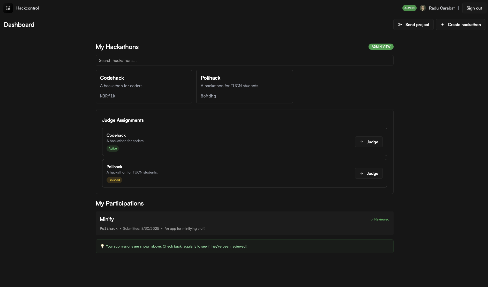

# ✨ Hackcontrol

A modern, open-source hackathon management platform that streamlines event organization, participant registration, project submissions, and judging workflows.

<div align="center">

</div>

## 📚 Documentation

For detailed documentation, please visit our [mdbook documentation](https://raducarabat.github.io/hkcl_book/).

## 🛠️ Tech Stack

- **Next.js** - React framework with TypeScript
- **Prisma** - Database ORM with CockroachDB
- **tRPC** - End-to-end typesafe APIs
- **NextAuth.js** - Authentication solution
- **Tailwind CSS** - Utility-first styling
- **Framer Motion** - Animation library

## ✨ Features

**Authentication & User Management:**
- GitHub OAuth integration
- Role-based access control (Admin, Organizer, Participant)

**Hackathon Management:**
- Create and manage hackathon events
- Custom event URLs and descriptions
- Team-based participation support
- Announcement system for event updates

**Project Submissions:**
- Participant project submissions
- Team member management
- Project review system
- Winner selection and marking

**Judging System:**
- Multi-judge scoring system
- Judge invitation and management
- Comprehensive scoring with minimum judge requirements
- Real-time scoring updates

**Administrative Tools:**
- Event dashboard 
- Participant management

## 🚀 Getting Started

### **Project settings:**

1. Clone the repository:

```bash
git clone https://github.com/[raducarabat]/hackcontrol.git
```

2. Navigate to the project directory:

```bash
cd hackcontrol
```

3. Install dependencies with your favorite package manager:

```bash
# with npm:
npm install

# with pnpm:
pnpm install

# with yarn:
yarn install
```

### **Environment variables:**

4. Create a `.env` file in the root of the project with the following variables:

```env
# CockroachDB connection string:
DATABASE_URL = ""

# Next-Auth config:
NEXTAUTH_SECRET="" # Generate a random string.
NEXTAUTH_URL="" # Your project url, e.g. http://localhost:3000.

# Github OAuth Provider:
GITHUB_CLIENT_ID=""
GITHUB_CLIENT_SECRET=""
```

### **CockroachDB settings:**

5. [**Create a free cluster**](https://www.cockroachlabs.com/docs/cockroachcloud/quickstart.html?#create-a-free-cluster).
6. [**Create a SQL user**](https://www.cockroachlabs.com/docs/cockroachcloud/quickstart.html?#create-a-sql-user).
7. To connect to the user, copy the connection string and paste it in the `.env` file,
   replacing the `DATABASE_URL` variable.

### **Github OAuth Provider settings:**

8. [Click here to create new Github OAuth app](https://github.com/settings/applications/new).
9. Go to "Client secrets" and generate new client secret and and paste it into GITHUB_CLIENT_SECRET env.
10. Copy the Client ID and paste it into GITHUB_ID env.

### **Run the project:**

11. Run in your terminal:

```bash
# with npm:
npm run dev

# with pnpm:
pnpm run dev

# with yarn:
yarn dev
```

and open [http://localhost:3000](http://localhost:3000) 🚀.

## 🙌 Contributing

If you want to add a new feature, fix a bug, improve the documentation or have an idea, feel free to create an issue or submit a pull request.

## 📄 License

This project is licensed under the [MIT License](LICENSE).
